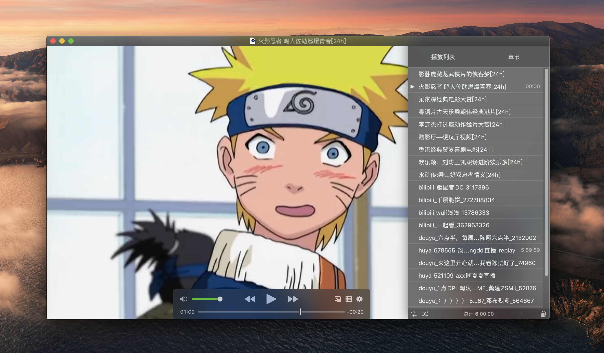

# alfred-real-url-workflow
An Alfred workflow for real-url, play your live playlist using IINA/Pot player/VLC.

This workflow is using to watch live stream of chinese live broadcast platform such as douyu, huya, etc.

This is also a project to learn Golang.

<p align="center">
  
</p>

## Usage
### run from Command Line
No need to install any modules(thanks for golang)
```
// open and update url
// just run the code directly

// open by room id
$ ./main play {platform} {room_id}

Example:
$ ./main play douyu 9999

// open room from local list, if not set platform, then will open all rooms
$ ./main play {platform}

// add room to local list
$ ./main add {platform} {room_id}

// open directly without update url
$ ./main play
```

## Features
- Play all kinds of live in one window
- Display room info
- Cache real url in local file
- Read and Edit room list from Json file
- Concurrency get real url(Very fast even have many rooms)

## Support Platforms
- [x] bilibili
- [x] zhanqi
- [x] douyu
- [x] youku
- [x] huya

## Alfred workflow
[Download](./static/go-real-url.alfredworkflow)

```
1. add a room by id:
go add [paltform] [roomid]

2. play all added rooms together(this will update the url)
go

3. play by cached url(you need update the url per day)
go play

4. play a single stream
go play [platform] [roomid]

5. play a specific cached platform streams
go play [platform]
```

## Reference
[wbt5/real-url](https://github.com/wbt5/real-url)